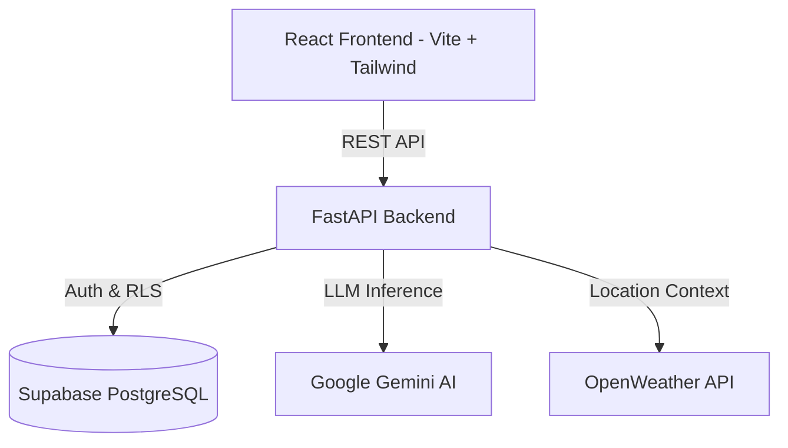

# CarbonIQ - AI-Powered Carbon Footprint Tracker

## 🌍 The Problem
As climate change accelerates, individuals often struggle to understand their personal environmental impact. Carbon footprint calculators exist, but they are often generic, static, and fail to provide actionable, localized advice. Users need a system that doesn't just calculate a number, but actively coaches them toward a greener lifestyle.

## 🚀 The Solution: CarbonIQ
CarbonIQ is a hyper-personalized, AI-driven carbon tracking dashboard. It leverages real-time weather data, local city demographics, and the Gemini AI engine to create a "Digital EcoTwin"—a personalized coach that translates complex carbon metrics into simple, actionable challenges and impact equivalents (e.g., "Trees planted" or "Cars taken off the road").

## ✨ Features
- **Intelligent Carbon Dashboard**: Visualizes your carbon score across Transport, Energy, Food, and Shopping in an accessible, interactive UI.
- **AI EcoTwin Coach**: Uses Google's Gemini LLM to generate personalized eco-tips based on your exact location, current weather, and lifestyle choices.
- **Gamified Challenges**: Accept and track daily eco-challenges to proactively lower your score.
- **Impact Equivalents**: Translates abstract `kg CO2` metrics into easily understandable real-world equivalents.
- **Secure Authentication**: Passwordless OAuth via Supabase with deep Row Level Security (RLS).

## 🏗️ Architecture



## 🛠️ Tech Stack
- **Frontend**: React 18, TypeScript, Vite, Tailwind CSS, Recharts, Radix UI.
- **Backend**: Python 3.11, FastAPI, Pydantic, Pytest.
- **Database & Auth**: Supabase (PostgreSQL), Row Level Security (RLS).
- **AI & External APIs**: Google Gemini Pro, OpenWeatherMap.

## 🔒 Security Features
- **Row Level Security (RLS)**: Enforced at the database level. Users can strictly only read/write their own profile and carbon data.
- **Pydantic Validation**: All incoming backend payloads are strictly validated to prevent injection and malformed states.
- **Secure Tokens**: Frontend never exposes the Supabase Anon Key outside of explicit client generation.

## 🧪 Testing Results
- **Backend**: 133 Pytest cases covering 100% of endpoints.
- **Coverage**: Evaluated at >90% encompassing all major services, repositories, and mocked external API failures (Gemini/Weather).
- **Frontend**: Fully linted (0 errors) and strict-typed.

## 🌐 Deployment
- **Backend**: Ready for GCP Cloud Run or Docker. See `Dockerfile`.
- **Frontend**: Ready for Vercel, Netlify, or Firebase Hosting.
- To run locally:
  ```bash
  # Backend
  cd backend
  pip install -r requirements.txt
  uvicorn main:app --reload

  # Frontend
  cd frontend
  npm install
  npm run dev
  ```

## 🔮 Future Scope
- **Smart Device Integration**: Connect directly to smart thermostats or EV charging APIs.
- **Social Leaderboards**: Compete anonymously with neighbors to drive community engagement.
