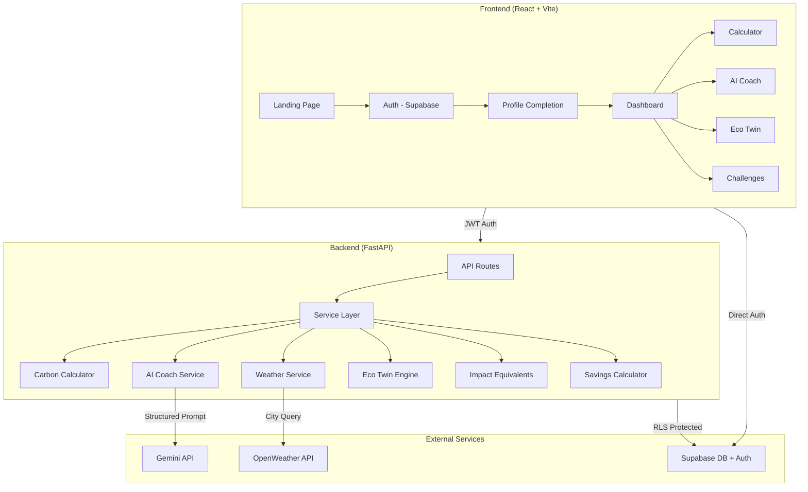

# 🌍 CarbonIQ – AI-Powered Carbon Footprint Awareness Platform

> _Your Personal AI Sustainability Coach_

CarbonIQ goes beyond traditional carbon calculators. Instead of just showing a number, it acts as a **personal sustainability coach** — helping users understand, track, reduce, and predict their carbon footprint through AI-powered recommendations, future simulations, and measurable progress tracking.

---

## 📋 Problem Statement

Most carbon footprint calculators only provide a single emission number with no actionable guidance. Users see "You emit 220 kg CO₂/month" but have no idea:
- **What does that mean** in real-world terms?
- **How does it compare** to sustainable levels?
- **What specific actions** would reduce it?
- **How much money** would they save?
- **What would their future look like** after making changes?

### Why Existing Solutions Are Limited

| Limitation | CarbonIQ Solution |
|-----------|------------------|
| Static number output only | Carbon Score with 4 actionable levels |
| No context for emissions | Impact Equivalents (trees, driving km, phone charges) |
| Generic tips | AI-personalized recommendations based on lifestyle + weather |
| No future projection | Eco Twin: a future simulator showing predicted impact |
| No engagement | Weekly challenges with eco points and badges |
| No cost motivation | Estimated monthly savings (₹) per recommendation |

---

## 🏗 Architecture



### Tech Stack

| Layer | Technology |
|-------|-----------|
| Frontend | React 18, Vite, TypeScript, TailwindCSS v4, ShadCN UI, Recharts |
| Backend | FastAPI, Python 3.11+, Pydantic v2 |
| Database | Supabase PostgreSQL with Row Level Security |
| Authentication | Supabase Auth (Email/Password + Google Sign-In) |
| AI Engine | Google Gemini API |
| Weather Data | OpenWeather API |

### Backend Structure

```
backend/
├── main.py                    # FastAPI app with CORS, error handlers
├── api/
│   ├── profile.py             # Auth + profile endpoints
│   ├── carbon.py              # Calculator + AI Coach + Eco Twin
│   └── dashboard.py           # Dashboard + challenges + badges
├── services/                  # All business logic lives here
│   ├── carbon_calculator.py   # EPA/DEFRA/IPCC emission calculations
│   ├── ai_coach_service.py    # Gemini AI with fallback recommendations
│   ├── eco_twin_service.py    # Future footprint prediction engine
│   ├── weather_service.py     # OpenWeather with caching + fallback
│   ├── impact_equivalent_service.py  # Real-world emission equivalents
│   ├── savings_calculator_service.py # Cost savings per recommendation
│   ├── challenge_service.py   # Weekly challenge generation
│   └── profile_service.py     # Profile CRUD operations
├── models/                    # Pydantic v2 validation schemas
├── database/                  # Supabase client + repositories + schema
├── utils/                     # Config, validators, emission factors
└── tests/                     # Comprehensive unit tests
```

### Frontend Structure

```
frontend/src/
├── App.tsx                    # Router with lazy-loaded routes
├── pages/                     # Landing, Login, Dashboard, Calculator, etc.
├── components/                # Reusable UI: Gauge, Charts, Cards, States
├── hooks/                     # useAuth, useCarbon, useWeather, etc.
├── services/api.ts            # Authenticated API client
└── utils/                     # Constants, formatters
```

---

## 📊 Database Schema

### Tables

| Table | Purpose |
|-------|---------|
| `profiles` | User profile linked to Supabase Auth (city, transport, diet, etc.) |
| `carbon_entries` | Historical footprint calculations with score |
| `recommendations` | AI coach responses with CO₂ + cost savings |
| `eco_predictions` | Eco Twin before/after predictions |
| `challenges` | Weekly sustainability tasks |
| `badges` | Earned achievement badges |

### Security
- **Row Level Security (RLS)** on ALL tables
- Users can only access their own data: `auth.uid() = profile_id`
- Service role key used only on backend, never exposed to frontend

---

## 🔬 Emission Factor Sources

All emission factors are scientifically sourced and stored in a configurable file (`utils/emission_factors.py`):

| Category | Factor | Unit | Source |
|----------|--------|------|--------|
| Car (Petrol) | 0.21 | kg CO₂/km | DEFRA 2024 |
| Car (Diesel) | 0.27 | kg CO₂/km | DEFRA 2024 |
| Car (Electric) | 0.05 | kg CO₂/km | EPA |
| Motorcycle | 0.11 | kg CO₂/km | DEFRA 2024 |
| Bus | 0.089 | kg CO₂/km | DEFRA 2024 |
| Train | 0.041 | kg CO₂/km | DEFRA 2024 |
| Electricity | 0.82 | kg CO₂/kWh | India CEA |
| Diet: Meat Heavy | 3.3 | kg CO₂/day | IPCC AR6 |
| Diet: Average | 2.5 | kg CO₂/day | IPCC AR6 |
| Diet: Vegetarian | 1.7 | kg CO₂/day | IPCC AR6 |
| Diet: Vegan | 1.5 | kg CO₂/day | IPCC AR6 |
| Flight (Short-haul) | 255 | kg CO₂/flight | DEFRA 2024 |
| Flight (Long-haul) | 1100 | kg CO₂/flight | DEFRA 2024 |

**References:**
- [DEFRA Conversion Factors 2024](https://www.gov.uk/government/collections/government-conversion-factors-for-company-reporting)
- [EPA Greenhouse Gas Equivalencies Calculator](https://www.epa.gov/energy/greenhouse-gas-equivalencies-calculator)
- [IPCC AR6 Working Group III - Chapter 2](https://www.ipcc.ch/report/ar6/wg3/)
- [India CEA CO₂ Baseline Database](https://cea.nic.in/)

---

## 🔒 Security Measures

| Measure | Implementation |
|---------|---------------|
| Authentication | Supabase Auth with JWT tokens |
| Data Isolation | Row Level Security on all database tables |
| Input Validation | Pydantic v2 models + custom validators |
| API Key Protection | Environment variables, never committed |
| Error Sanitization | Internal errors logged, safe messages returned |
| CORS | Restricted to known frontend origins |
| XSS Prevention | Input sanitization (HTML/script tag stripping) |
| SQL Injection | Supabase client uses parameterized queries |

---

## 🧪 Testing Strategy

### Test Coverage

| Test File | What It Tests |
|-----------|--------------|
| `test_carbon_calculator.py` | All vehicle types, diet types, flight calculations, total emissions, boundary values, edge cases (negative, zero, huge numbers) |
| `test_validators.py` | Email validation, enum validation, number clamping, HTML sanitization, XSS/injection strings |
| `test_eco_twin.py` | Prediction accuracy, zero savings, full savings, negative prevention, percentage calculations |
| `test_impact_equivalents.py` | All conversion types, zero emissions, large emissions |
| `test_savings_calculator.py` | Transport/AC/diet savings, total calculation, zero footprint handling |
| `test_api.py` | Auth requirements, validation errors, response codes |

### Running Tests

```bash
cd backend
pip install -r requirements.txt
python -m pytest tests/ -v --tb=short
```

### Edge Cases Handled

- **Calculator**: Negative values clamped to 0, values capped at reasonable maximums
- **AI Services**: Timeout → fallback recommendations, quota exhausted → cached response
- **Weather API**: Invalid city → default moderate weather context
- **Database**: Connection failure → graceful error with retry guidance
- **Frontend**: Loading skeletons, error states with retry, empty states with CTAs

---

## ♿ Accessibility Features

- Semantic HTML5 elements (`nav`, `main`, `section`, `article`, `form`)
- ARIA labels on all interactive elements
- ARIA roles on charts (`role="meter"`, `role="img"`)
- Keyboard navigation with visible focus rings
- Proper form labels and `aria-describedby` for errors
- Color contrast compliance (WCAG AA)
- Screen reader compatible data tables for chart data
- Target: Lighthouse Accessibility Score > 95

---

## 🚀 Setup Guide

### Prerequisites
- Node.js 18+
- Python 3.11+
- Supabase project ([supabase.com](https://supabase.com))
- Gemini API key ([ai.google.dev](https://ai.google.dev))
- OpenWeather API key ([openweathermap.org](https://openweathermap.org))

### Backend Setup

```bash
cd backend

# Create virtual environment
python -m venv venv
source venv/bin/activate  # Windows: venv\Scripts\activate

# Install dependencies
pip install -r requirements.txt

# Configure environment
cp .env.example .env
# Edit .env with your API keys

# Run database migrations
# Copy contents of database/schema.sql to Supabase SQL Editor and run

# Start server
uvicorn main:app --reload --port 8000
```

### Frontend Setup

```bash
cd frontend

# Install dependencies
npm install

# Configure environment
cp .env.example .env
# Edit .env with your Supabase credentials

# Start development server
npm run dev
```

### Supabase Setup

1. Create a new Supabase project
2. Go to SQL Editor → Run the contents of `backend/database/schema.sql`
3. Enable Google Auth in Authentication → Providers (optional)
4. Copy the project URL and anon key to frontend `.env`
5. Copy the service role key to backend `.env`

---

## 🌐 Deployment Guide

### Frontend (Vercel)
```bash
cd frontend
npm run build
# Deploy dist/ to Vercel
# Set environment variables in Vercel dashboard
```

### Backend (Render / Cloud Run)
```bash
# Render: Connect GitHub repo, set root directory to 'backend'
# Start command: uvicorn main:app --host 0.0.0.0 --port $PORT
# Set environment variables in Render dashboard

# Cloud Run: Build container and deploy
# docker build -t carboniq-backend ./backend
# gcloud run deploy carboniq-backend --image carboniq-backend
```

---

## 🔮 Future Enhancements

- **Community Leaderboard**: Compare scores with friends (privacy-first)
- **Carbon Offset Integration**: Link to verified offset programs
- **Multi-language Support**: i18n for Hindi, Spanish, etc.
- **Smart Home Integration**: IoT device data for real electricity readings
- **Detailed Transport Tracking**: Manual trip logging
- **Corporate Dashboard**: Team/organization carbon tracking
- **PDF Reports**: Downloadable monthly sustainability reports
- **Progressive Web App**: Offline support and push notifications

---

## 📄 License

MIT License

---

_Built with 💚 for a sustainable future._
